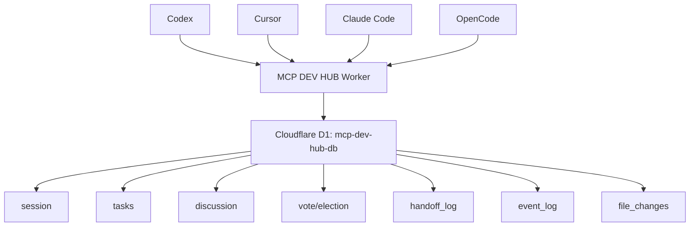

# MCP DEV HUB v3

Cloudflare Workers + D1 기반의 다중 AI 개발 조정용 MCP 서버입니다.

Codex, Cursor, Claude Code, OpenCode가 같은 `dev-hub` MCP 서버를 바라보며 세션, 태스크, 토론, 투표, 핸드오프, 파일 변경 기록을 공유합니다.

## Current Deployment

| 항목        | 값                                                 |
| ----------- | -------------------------------------------------- |
| Worker      | `mcp-dev-hub`                                      |
| URL         | `https://mcp-dev-hub.mscho715.workers.dev/mcp`     |
| Health      | `https://mcp-dev-hub.mscho715.workers.dev/health`  |
| D1 database | `mcp-dev-hub-db`                                   |
| D1 binding  | `env.DB`                                           |
| Auth        | `x-api-key` 또는 `Authorization: Bearer <API_KEY>` |
| Tool count  | 31                                                 |

API 키는 Cloudflare Secret `API_KEY`로 관리합니다.
키 값을 README, Git, 채팅, 로그에 남기지 마세요.

## Architecture



## Project Layout

```text
src/
  index.ts                 # Worker entrypoint and MCP JSON-RPC router
  lib/
    auth.ts                # API key auth wrapper
    cors.ts                # CORS wrapper
    db.ts                  # DB helper exports
    errors.ts              # JSON-RPC error exports
    mcp.ts                 # MCP types and shared helpers
  db/
    schema.sql             # D1 schema
    queries.ts             # SQL query module placeholder
  tools/
    dashboard.ts           # get_dashboard
    session.ts             # start/get/close session
    retro.ts               # submit/get/finalize retro
    election.ts            # leader election
    state.ts               # agent state
    task.ts                # task registry
    discussion.ts          # discussion and consensus
    vote.ts                # vote workflow
    handoff.ts             # handoff workflow
    lock.ts                # task locks
    file.ts                # file change record
    event.ts               # broadcast and event log
tests/
  helpers/d1Mock.ts        # D1 test double
docs/traceability/
  tool-inventory-v3.md     # v3 tool inventory
```

Legacy v1/v2/root v3 files were moved under `_legacy/`.
The active Worker entrypoint is `src/index.ts`.

## Local Setup

```powershell
npm install
npm run validate
npm run test:coverage
```

Run the Worker locally:

```powershell
npm run dev
```

Local health check:

```powershell
Invoke-WebRequest -Uri "http://127.0.0.1:8787/health" -UseBasicParsing
```

## Deploy

Production D1 schema:

```powershell
npm run db:init:prod
```

Deploy Worker:

```powershell
npm run deploy
```

Dry-run deploy:

```powershell
npx wrangler deploy --dry-run --env="" --outdir .wrangler\dry-run
```

Set or rotate the production API key:

```powershell
$apiKey = [Convert]::ToHexString([System.Security.Cryptography.RandomNumberGenerator]::GetBytes(32)).ToLowerInvariant()
Set-Content -LiteralPath "$env:USERPROFILE\.codex\secrets\mcp-dev-hub-api-key.txt" -Value $apiKey -NoNewline -Encoding ascii
[Environment]::SetEnvironmentVariable("MCP_DEV_HUB_API_KEY", $apiKey, "User")
$env:MCP_DEV_HUB_API_KEY = $apiKey
$apiKey | npx wrangler secret put API_KEY --env=""
```

Do not print the key after creation.

## MCP Client Configuration

Use this server name everywhere:

```text
dev-hub
```

Use this URL everywhere:

```text
https://mcp-dev-hub.mscho715.workers.dev/mcp
```

### Codex

Codex global MCP config lives in:

```text
C:\Users\jichu\.codex\config.toml
```

Register the server:

```powershell
codex mcp add dev-hub --url "https://mcp-dev-hub.mscho715.workers.dev/mcp" --bearer-token-env-var MCP_DEV_HUB_API_KEY
```

Verify:

```powershell
codex mcp get dev-hub
codex mcp list
```

Expected shape:

```text
dev-hub
  enabled: true
  transport: streamable_http
  url: https://mcp-dev-hub.mscho715.workers.dev/mcp
  bearer_token_env_var: MCP_DEV_HUB_API_KEY
```

Restart Codex after adding the MCP server so the current session can load it.

### Cursor

Project-local config:

```text
C:\Users\jichu\Downloads\MACHO-GPT SDLC\.cursor\mcp.json
```

Example:

```json
{
  "mcpServers": {
    "dev-hub": {
      "type": "url",
      "url": "https://mcp-dev-hub.mscho715.workers.dev/mcp",
      "headers": {
        "x-api-key": "YOUR_API_KEY",
        "Authorization": "Bearer YOUR_API_KEY"
      }
    }
  }
}
```

`.cursor/mcp.json` is ignored by Git because it contains a real key.

### Claude Code

Claude Code user config is:

```text
C:\Users\jichu\.claude.json
```

Register with a header:

```powershell
claude mcp add --transport http --scope user dev-hub "https://mcp-dev-hub.mscho715.workers.dev/mcp" --header "Authorization: Bearer YOUR_API_KEY"
```

Verify without printing headers:

```powershell
claude mcp list
```

Expected result:

```text
dev-hub: https://mcp-dev-hub.mscho715.workers.dev/mcp (HTTP) - ✓ Connected
```

Warning: some Claude Code versions print configured headers in `claude mcp get`.
Avoid running `claude mcp get dev-hub` when the static header contains a real token.

### OpenCode

Global config:

```text
C:\Users\jichu\.config\opencode\opencode.jsonc
```

Example:

```jsonc
{
  "$schema": "https://opencode.ai/config.json",
  "mcp": {
    "dev-hub": {
      "type": "remote",
      "url": "https://mcp-dev-hub.mscho715.workers.dev/mcp",
      "oauth": false,
      "enabled": true,
      "headers": {
        "Authorization": "Bearer {env:MCP_DEV_HUB_API_KEY}",
      },
    },
  },
}
```

Restart OpenCode after editing this file.

## Remote Verification

Health:

```powershell
Invoke-WebRequest -Uri "https://mcp-dev-hub.mscho715.workers.dev/health" -UseBasicParsing
```

MCP ping:

```powershell
$apiKey = (Get-Content -LiteralPath "$env:USERPROFILE\.codex\secrets\mcp-dev-hub-api-key.txt" -Raw).Trim()
$body = '{"jsonrpc":"2.0","id":1,"method":"ping","params":{}}'
Invoke-WebRequest `
  -Uri "https://mcp-dev-hub.mscho715.workers.dev/mcp" `
  -Method POST `
  -Headers @{ Authorization = "Bearer $apiKey"; "content-type" = "application/json"; accept = "application/json, text/event-stream" } `
  -Body $body `
  -UseBasicParsing
```

Tool list:

```powershell
$apiKey = (Get-Content -LiteralPath "$env:USERPROFILE\.codex\secrets\mcp-dev-hub-api-key.txt" -Raw).Trim()
$body = '{"jsonrpc":"2.0","id":1,"method":"tools/list","params":{}}'
$response = Invoke-WebRequest `
  -Uri "https://mcp-dev-hub.mscho715.workers.dev/mcp" `
  -Method POST `
  -Headers @{ Authorization = "Bearer $apiKey"; "content-type" = "application/json"; accept = "application/json, text/event-stream" } `
  -Body $body `
  -UseBasicParsing
($response.Content | ConvertFrom-Json).result.tools.Count
```

Expected tool count:

```text
31
```

Unauthenticated calls must fail:

```powershell
Invoke-WebRequest `
  -Uri "https://mcp-dev-hub.mscho715.workers.dev/mcp" `
  -Method POST `
  -Headers @{ "content-type" = "application/json" } `
  -Body '{"jsonrpc":"2.0","id":1,"method":"tools/list","params":{}}' `
  -UseBasicParsing
```

Expected status is `401`.

## Tool Inventory

| Domain     | Tools                                                                                       |
| ---------- | ------------------------------------------------------------------------------------------- |
| Dashboard  | `get_dashboard`                                                                             |
| Session    | `start_session`, `get_session`, `close_session`                                             |
| Retro      | `submit_retro`, `get_retro`, `finalize_retro`                                               |
| Election   | `start_election`, `cast_election_vote`, `get_election_result`                               |
| State      | `get_state`, `update_state`                                                                 |
| Task       | `create_task`, `list_tasks`, `update_task`                                                  |
| Discussion | `start_discussion`, `post_message`, `get_discussion`, `close_discussion`, `check_consensus` |
| Vote       | `create_vote`, `cast_vote`, `get_vote_result`                                               |
| Handoff    | `log_handoff`, `get_handoff`, `ack_handoff`                                                 |
| Lock       | `lock_task`, `unlock_task`                                                                  |
| File       | `record_file_change`                                                                        |
| Event      | `broadcast_event`, `get_events`                                                             |

`get_file_history` is not part of v3.
It existed only in older README/root references.

## Agent Workflow

### 1. Start Work

```text
get_dashboard()
get_handoff(agent)
list_tasks(status?)
lock_task(task_id, agent)
update_state(agent, "working", task_id)
```

### 2. During Work

```text
record_file_change(task_id, path, agent, action)
post_message(thread_id, agent, message)
broadcast_event(event_type, agent, message)
```

### 3. Handoff

```text
log_handoff(from_agent, to_agent, task_id, summary)
ack_handoff(handoff_id, agent)
unlock_task(task_id, agent)
update_state(agent, "idle")
```

### 4. Session Lifecycle

```text
start_session(title, leader, goals)
close_session(session_id, summary)
submit_retro(session_id, agent, ...)
finalize_retro(session_id)
start_election(session_id)
cast_election_vote(election_id, agent, nominee)
get_election_result(election_id, auto_start_next=true)
```

## MACHO-GPT ZERO Rules

| Condition                                                     | Action                                          |
| ------------------------------------------------------------- | ----------------------------------------------- |
| `lock_task` returns `locked: true`                            | ZERO-T2: wait because another AI owns the task  |
| Work starts without checking `get_handoff`                    | ZERO-T1: stop because handoff was not confirmed |
| `get_dashboard` shows 2 or more blocked tasks                 | ZERO-T2: escalate                               |
| `finalize_retro` completes but `start_election` is not called | ZERO-T3: warn about session deadlock            |

## Development Commands

```powershell
npm run type-check
npm test
npm run lint
npm run format:check
npm run validate
npm run test:coverage
```

Quality gate:

```powershell
npm run validate
npm run test:coverage
npx wrangler deploy --dry-run --env="" --outdir .wrangler\dry-run
```

## Current Validation Snapshot

Last verified in this workspace:

```text
npm run validate        PASS
npm run test:coverage   PASS
npm run deploy          PASS
remote /health          200
remote ping             200
remote tools/list       31 tools
claude mcp list         dev-hub ✓ Connected
```

Last deployed Worker version:

```text
6e7a9320-4905-4ee2-85f7-b9bf6533ec19
```

## Security Notes

- Never commit `.cursor/mcp.json`.
- Never commit `.claude.json` if it contains a static `Authorization` header.
- Prefer `MCP_DEV_HUB_API_KEY` environment variable where the client supports it.
- Rotate Cloudflare Secret `API_KEY` immediately if a key appears in terminal output, chat, screenshots, or logs.
- Keep D1 as the single source of truth. Do not add file or memory caches for shared state.

## Troubleshooting

### `401 Unauthorized`

The client did not send the same key stored in Cloudflare Secret `API_KEY`.
Rotate and reapply the key across all clients.

### Claude shows `Failed to connect`

Check:

```powershell
claude mcp list
```

Then verify the Worker supports `ping`:

```powershell
$apiKey = (Get-Content -LiteralPath "$env:USERPROFILE\.codex\secrets\mcp-dev-hub-api-key.txt" -Raw).Trim()
Invoke-WebRequest `
  -Uri "https://mcp-dev-hub.mscho715.workers.dev/mcp" `
  -Method POST `
  -Headers @{ Authorization = "Bearer $apiKey"; "content-type" = "application/json" } `
  -Body '{"jsonrpc":"2.0","id":1,"method":"ping","params":{}}' `
  -UseBasicParsing
```

### Cursor or OpenCode does not show `dev-hub`

Restart the app after editing config.
MCP clients usually load config at startup.

### D1 schema did not apply to production

Make sure `db:init:prod` includes `--remote`:

```powershell
npm run db:init:prod
```

Expected line:

```text
Resource location: remote
```
