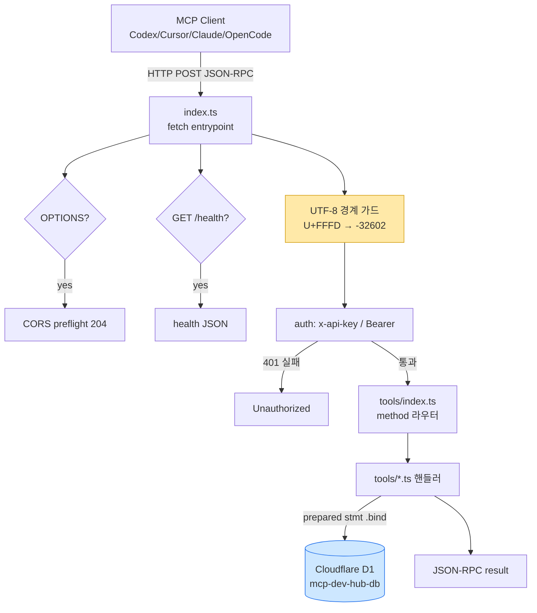
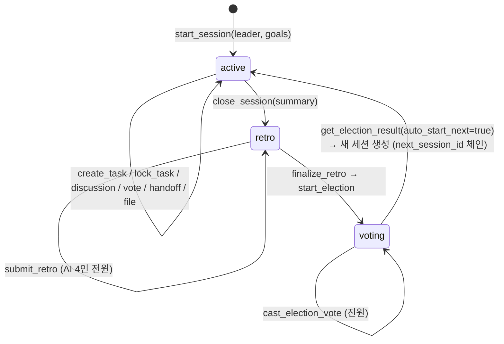

# SYSTEM ARCHITECTURE — mcp-dev-hub v3

> 시스템 구조·요청 흐름·데이터 모델 전용 문서. 파일/폴더 배치는 [SYSTEM_LAYOUT.md](SYSTEM_LAYOUT.md), 사용법·배포는 [README.md](README.md) 참조.
> 최종 갱신: 2026-06-13

## 1. 개요

mcp-dev-hub는 **여러 AI(Codex·Claude·OpenCode·Hermes)가 하나의 상태 원장을 공유**하도록 하는 MCP 서버다. 단일 Cloudflare Worker가 MCP JSON-RPC 2.0 요청을 받아 Cloudflare D1(SQLite)에 모든 상태를 기록한다. **D1이 유일한 진실 원천(SSOT)** — 메모리·파일 캐시·글로벌 상태를 두지 않는다.

## 2. 요청 처리 흐름

처리 순서:

1. **OPTIONS** → CORS preflight 즉시 응답
2. **GET `/health`** → 상태·버전·기능 목록 반환 (인증 불요)
3. **GET `/dashboard` · `/api/dashboard` · `/api/mcp-status` · `/api/projects`** (2026-06-13~) → 공개 읽기 전용. 대시보드 HTML 셸과 상태·프로젝트 스냅샷을 인증 없이 반환 (키 입력 프롬프트 없음). 쓰기는 불가
4. **POST** → ① UTF-8 경계 가드(`U+FFFD` 포함 시 `-32602` 거부) → ② API_KEY 인증(`x-api-key` 또는 `Bearer`, 실패 시 `401`) → ③ `tools/index.ts` 라우터가 `method`로 분기 → ④ 도메인 핸들러가 D1 prepared statement 실행 → ⑤ JSON-RPC `result` 반환

## 3. 계층 구조

| 계층          | 책임                                                                                        | 위치                 |
| ------------- | ------------------------------------------------------------------------------------------- | -------------------- |
| Entrypoint    | fetch 핸들러, MCP 메서드 분기(initialize/tools.list/tools.call/ping), 경계 가드             | `src/index.ts`       |
| Cross-cutting | 인증(`auth.ts`), CORS(`cors.ts`), 에러 코드(`errors.ts`), 공유 타입·헬퍼·`nextId`(`mcp.ts`) | `src/lib/`           |
| Tool Router   | 31개 도구 레지스트리 + `tools/call` 디스패치                                                | `src/tools/index.ts` |
| Tool Handlers | 도메인별 비즈니스 로직 (10개 도메인)                                                        | `src/tools/*.ts`     |
| Data          | D1 스키마(SSOT), 쿼리 모듈                                                                  | `src/db/`            |
| Dashboard     | 상태 스냅샷 데이터·페이지 렌더                                                              | `src/dashboard/`     |

## 4. 데이터 모델 (D1 — 16 테이블)

테이블은 10개 도메인으로 묶인다. 컬럼 상세는 `src/db/schema.sql`(SSOT)을 참조 — 여기서는 책임만 기술한다.

| 도메인     | 테이블                                                     | 역할                                                                 |
| ---------- | ---------------------------------------------------------- | -------------------------------------------------------------------- |
| Session    | `session`                                                  | 작업 세션 (active→retro→voting 라이프사이클, `next_session_id` 체인) |
| State      | `ai_state`                                                 | AI별 현재 상태(working/idle/blocked/…)·진행률·현재 파일              |
| Task       | `tasks`, `task_lock`                                       | 태스크 레지스트리 + 동시성 잠금(TTL)                                 |
| Discussion | `discussion_thread`, `discussion_message`, `consensus_log` | 토론 스레드·발언·합의 기록                                           |
| Vote       | `vote`, `vote_ballot`                                      | 일반 투표 + 표                                                       |
| Election   | `leader_election`, `election_ballot`                       | 다음 세션 리더 선거 + 표                                             |
| Retro      | `retro_review`, `retro_summary`                            | AI별 회고 제출 + 집계 요약(MVP)                                      |
| Handoff    | `handoff_log`                                              | AI 간 작업 인계                                                      |
| Event      | `event_log`                                                | 브로드캐스트 이벤트 로그                                             |
| File       | `file_changes`                                             | 파일 변경 기록                                                       |

> **Presence(heartbeat) 모델** (2026-06-13): 대시보드 AI 상태는 `ai_state.updated_at` 경과시간으로 산출(`src/dashboard/data.ts`의 `derivePresence`) — ≤120s `online`, ≤600s `stale`(지연), 그 외 `offline`(오프라인). `updated_at`이 NULL이면 `unknown`(미연결) = seed 후 한 번도 `update_state`를 호출하지 않은 에이전트로, "연결됐다 끊김"(offline)과 구분된다. 에이전트가 `online`을 유지하려면 120초 내 `update_state`로 heartbeat를 보내야 한다(연동: [docs/agent-heartbeat.md](docs/agent-heartbeat.md)).

> **dev hub 작업 이어받기 트리거** (2026-06-13): 사용자가 채팅에 `dev hub`(또는 `/dev-hub`)를 입력하면 각 에이전트가 `get_handoff`→`get_dashboard`→`list_tasks` 고정 시퀀스를 실행해, 자신에게 온 핸드오프/할당 태스크를 자동으로 이어받는다. 핸드오프가 없으면 임의 작업을 만들지 않는다(ZERO-T1). 트리거 정의는 codex·opencode 공유 `AGENTS.md`와 `CLAUDE.md`에, 표준 프로토콜은 [docs/dev-hub-pickup.md](docs/dev-hub-pickup.md)에 있다. 대시보드 `GET /dashboard`는 이 사용법을 접이식 패널로 표시하고, 트리거 칩 클릭 시 클립보드로 복사된다.

## 5. 세션 라이프사이클 상태 기계

ZERO 규칙(deadlock·중복 방지)은 [README.md](README.md)의 "MACHO-GPT ZERO Rules" 표 참조.

## 6. 핵심 불변식 (Invariants)

- **D1 SSOT**: 모든 공유 상태는 D1에만. 메모리/파일/글로벌 캐시 금지.
- **인증 필수(쓰기)**: 모든 POST(MCP 도구 호출)는 `x-api-key` 또는 `Bearer` 헤더 검증 통과 필요. 단 대시보드용 GET 읽기 라우트(`/dashboard`·`/api/dashboard`·`/api/mcp-status`·`/api/projects`)는 공개 읽기 전용(2026-06-13~) — 데이터는 노출되지만 자격증명은 노출되지 않으며 변경은 불가.
- **JSON-RPC 2.0**: 응답은 항상 `{jsonrpc:'2.0', id, result|error}`. 에러 코드 -32700/-32600/-32601/-32602/-32603.
- **UTF-8 경계 검증** (2026-06-13~): 요청 body에 `U+FFFD` 포함 시 `-32602`로 거부 — 비-UTF-8 손상 payload의 D1 저장 차단.
- **ID 생성**: `nextId`는 `MAX(suffix)+1` (행 삭제 gap 시 충돌하는 `COUNT(*)` 금지).
- **prepared statement**: 모든 쿼리 `.bind()` (SQL injection 방지).

## 7. 배포 토폴로지

| 구성       | 값                                               |
| ---------- | ------------------------------------------------ |
| Worker     | `mcp-dev-hub` (`src/index.ts`)                   |
| Endpoint   | `https://mcp-dev-hub.mscho715.workers.dev/mcp`   |
| D1 binding | `env.DB` → `mcp-dev-hub-db`                      |
| Secret     | `env.API_KEY` (Cloudflare Secret)                |
| Runtime    | `compatibility_date` 2026-06-13, `nodejs_compat` |
