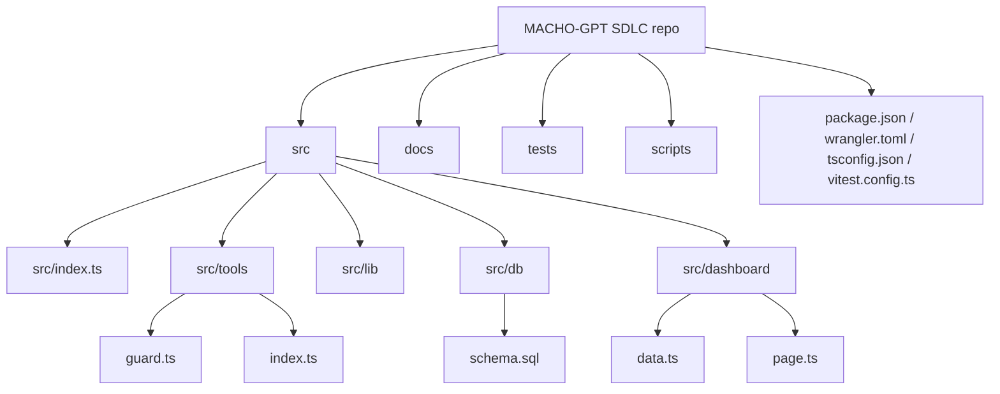

# Repository Layout

## Repository Layout

This document describes the current repository layout from the checked files in this workspace.

## Directory Responsibilities

| Path                 | Responsibility                                                                                          | Evidence                                                |
| -------------------- | ------------------------------------------------------------------------------------------------------- | ------------------------------------------------------- |
| `src/index.ts`       | Cloudflare Worker fetch entrypoint, HTTP routing, auth, UTF-8 body validation, JSON-RPC method dispatch | `main` in `wrangler.toml`, `package.json`               |
| `src/tools/`         | MCP tool definitions, D1-backed handlers, domain tests, contract snapshot                               | `src/tools/index.ts`, `src/tools/tool-contract.test.ts` |
| `src/tools/guard.ts` | Agent start guard and ZERO mapping for task start safety                                                | `validate_agent_start` definition                       |
| `src/lib/`           | Shared MCP types, auth/CORS/error wrappers, ID and contract helpers                                     | `src/lib/mcp.ts`, `src/lib/auth.ts`                     |
| `src/db/`            | D1 schema and query-group map                                                                           | `src/db/schema.sql`, `src/db/queries.ts`                |
| `src/dashboard/`     | Dashboard data aggregation and public dashboard shell                                                   | `src/dashboard/data.ts`, `src/dashboard/page.ts`        |
| `tests/helpers/`     | Unit-test D1 mock                                                                                       | `tests/helpers/d1Mock.ts`                               |
| `scripts/security/`  | Secret leak scanner used by `npm run security:secrets`                                                  | `scripts/security/no-secret-leak.mjs`                   |
| `docs/traceability/` | Tool inventory and contract hash traceability                                                           | `docs/traceability/tool-inventory-v3.md`                |

## Entrypoints

- Worker entrypoint: `src/index.ts`
- Tool registry: `src/tools/index.ts`
- D1 schema: `src/db/schema.sql`
- Dashboard data layer: `src/dashboard/data.ts`
- Dashboard page renderer: `src/dashboard/page.ts`
- Secret scan script: `scripts/security/no-secret-leak.mjs`

## Reusable and Shared Modules

- `src/lib/mcp.ts`: MCP request/result types, JSON-RPC helpers, deterministic tool contract hashing, and ID generation.
- `src/lib/auth.ts`: auth helper re-export.
- `src/lib/cors.ts`: CORS helper re-export.
- `src/lib/errors.ts`: JSON-RPC error helper re-export.
- `tests/helpers/d1Mock.ts`: test double used across tool and Worker tests.

## Generated and Operational Outputs

- `.wrangler/`: Wrangler local state and dry-run bundles.
- `coverage/`: Istanbul/Vitest coverage output.
- `graphify-out/`: graph analysis artifacts, including `graph.html`, `graph.json`, and `GRAPH_REPORT.md`.

These outputs are evidence artifacts, not active Worker source.
