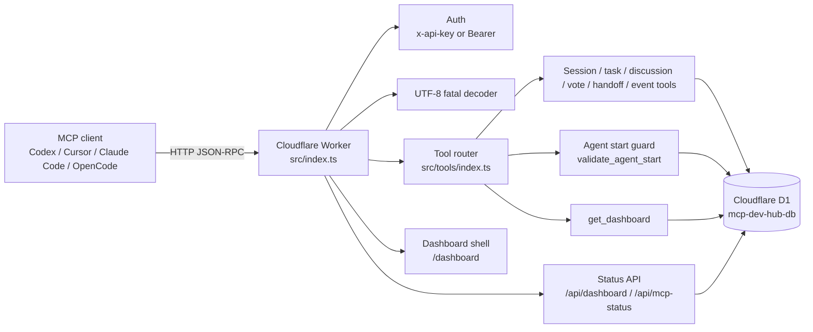

# System Architecture

## System Purpose

MCP DEV HUB v3 is a shared-state MCP server for multi-agent software development. It lets Codex, Cursor, Claude Code, and OpenCode coordinate through one Cloudflare Worker and one Cloudflare D1 database.

The active code path is `src/`. D1 is the single source of truth for shared state.

## Components

| Component          | Path                                  | Responsibility                                                                                                      |
| ------------------ | ------------------------------------- | ------------------------------------------------------------------------------------------------------------------- |
| Worker entrypoint  | `src/index.ts`                        | Handles CORS, GET routes, POST auth, UTF-8 byte validation, JSON-RPC methods, and tool calls                        |
| MCP shared library | `src/lib/mcp.ts`                      | Defines MCP types, tool result helpers, ID generation, tool schema version, and contract hashing                    |
| Tool registry      | `src/tools/index.ts`                  | Registers all tools and dispatches `tools/call` to domain handlers                                                  |
| Agent start guard  | `src/tools/guard.ts`                  | Checks active session, handoff acknowledgement, lock ownership, and blocked-task escalation                         |
| Domain tools       | `src/tools/*.ts`                      | D1-backed MCP handlers for sessions, tasks, discussions, votes, handoffs, locks, files, events, retro, and election |
| D1 schema          | `src/db/schema.sql`                   | Defines 16 D1 tables                                                                                                |
| Dashboard data     | `src/dashboard/data.ts`               | Builds dashboard and MCP status snapshots from D1                                                                   |
| Dashboard page     | `src/dashboard/page.ts`               | Renders the public HTML shell that calls authenticated APIs                                                         |
| Secret scanner     | `scripts/security/no-secret-leak.mjs` | Fails validation if raw auth tokens are present in documented scan targets                                          |

## Runtime and Data Flow

1. GET `/health` returns public health metadata.
2. GET `/dashboard` returns a public HTML shell. Live data still requires auth.
3. GET `/api/dashboard` and `/api/mcp-status` require an API key via header authentication.
4. POST requests require auth before JSON-RPC handling.
5. POST body bytes are decoded with a fatal UTF-8 decoder before JSON parsing.
6. `initialize`, `tools/list`, `ping`, `notifications/initialized`, and `tools/call` are handled in `src/index.ts`.
7. `tools/call` dispatches to `src/tools/index.ts`.
8. Tool handlers use D1 prepared statements and `.bind()`.

## D1 Data Model

`src/db/schema.sql` defines these 16 tables:

- `ai_state`
- `tasks`
- `discussion_thread`
- `discussion_message`
- `vote`
- `vote_ballot`
- `consensus_log`
- `handoff_log`
- `task_lock`
- `event_log`
- `file_changes`
- `session`
- `retro_review`
- `retro_summary`
- `leader_election`
- `election_ballot`

## External Dependencies

- Cloudflare Workers runtime.
- Cloudflare D1 binding `DB`.
- Cloudflare Secret `API_KEY`.
- Wrangler for local dev, migration, dry-run, and deployment.
- Vitest and `@cloudflare/vitest-pool-workers` for tests.
- TypeScript, ESLint, Prettier, and Istanbul coverage tooling.

## Tool Contract

Every registered tool exposes:

- `schema_version`: currently `v3.1`
- `contract_hash`: deterministic FNV-1a hash of name, description, input schema, annotations, and schema version

The snapshot test is `src/tools/tool-contract.test.ts`.
