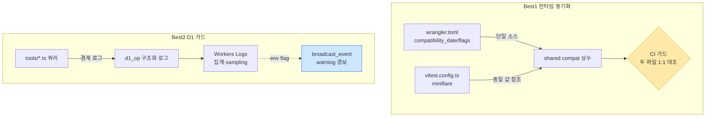

# Plan — Best2 업그레이드 (compatibility_date 동기화 + D1 한도 가드)

> 작성일: 2026-06-13 · 파이프라인: **[plan]** → review → ship → qa → retro
> 출처: project-upgrade v2.2 리포트 (Best1 Priority 15.0 + Best2 12.0 = "Option A 보수")
> 정책: 본 문서는 계획만 — 코드 변경/배포 없음. 승인 후 `/mstack-implement`.

## ⚠️ 리포트 vs 실제 코드 (검증 결과 반영)

| 리포트 전제                                 | 실제 코드                                                             | 계획 보정                                                       |
| ------------------------------------------- | --------------------------------------------------------------------- | --------------------------------------------------------------- |
| `compatibility_date`만 wrangler.toml에 존재 | **wrangler.toml + vitest.config.ts 양쪽 하드코딩** (둘 다 2025-01-01) | 두 파일 **동기화 + drift 가드**가 핵심                          |
| nodejs_compat 거짓통과 위험                 | 두 파일 플래그 일치 + **src에 `node:*` import 0개**                   | **유지 확정** — Cloudflare 공식이 명시 권장(node: 미사용이어도) |
| `lib/db.ts` 래퍼에 카운터 추가              | `db.ts` = **1줄 stub** (`export {nextId}`), 쿼리는 각 도구 분산       | 래퍼 신설 or 도구 경계 로깅 — 설계 결정 필요                    |

---

## Phase 1 — CEO Review

### 1.1 문제 정의

- **현재**: ① 런타임 호환 설정(`compatibility_date`·flags)이 wrangler.toml과 vitest.config.ts에 **이중 하드코딩**되어 한쪽만 바꾸면 테스트≠프로덕션 불일치 발생 가능. ② D1 무료 한도 초과 시 SSOT 전면 중단되나 **사용량 가시성·경보 없음**.
- **목표**: 런타임 동작을 테스트=프로덕션으로 보장(단일 소스화 + 가드) + D1 사용량 가시화 및 한도 임박 경보.
- **영향 범위**: 전 11개 도구의 신뢰성. 매출 영향 없음(내부 도구), 데이터 정합성·가용성 리스크 제거. 공수 ~1주.

### 1.2 제안 옵션

| 옵션         | 설명                                                                                    | 공수  | 리스크           | 비용(AED) |
| ------------ | --------------------------------------------------------------------------------------- | ----- | ---------------- | --------- |
| **A (추천)** | Best1(설정 동기화+CI 가드) + Best2-경량(도구 경계 `d1_op` 구조화 로그, 경보는 env flag) | 4일   | 낮음             | 0         |
| B            | A + D1 쿼리 게이트웨이 래퍼 신설(전 도구 라우팅 리팩터) + 한도 임계 자동 경보           | 8일   | 중(전 도구 변경) | 0         |
| C            | Best1만 (설정 동기화) — D1 가드는 별도 스프린트로 분리                                  | 1.5일 | 낮음             | 0         |

### 1.3 추천 & 근거

- **옵션 A 추천**. Best1은 0.5일 고확신 quick win. Best2는 **stub인 db.ts에 무리한 래퍼를 넣지 않고**, 도구 호출 경계에서 `d1_op` 구조화 로그만 emit → 관측성 확보. 자동 경보는 env flag로 점진 적용(폭주 방지).
- 옵션 B의 전(全)도구 래퍼 라우팅은 surgical 원칙 위배·리스크 과다 → 후속 스프린트로 분리.
- **롤백**: Best1은 설정 1~2줄 revert. Best2 로그는 라인 제거, 경보는 flag off.

### 1.4 승인 요청

`[ ] Phase 1 승인` (옵션 A/B/C 중 택1)

---

## Phase 2 — Engineering Review (옵션 A 기준)

### 2.1 아키텍처 다이어그램

### 2.2 파일 변경 목록

| 파일                              | 변경 유형  | 설명                                                                                                                             |
| --------------------------------- | ---------- | -------------------------------------------------------------------------------------------------------------------------------- |
| `wrangler.toml`                   | modify     | `compatibility_date` 2025-01-01 → **2026-06-13(오늘)** — Cloudflare 공식 권장값. `nodejs_compat` **유지**(공식 권장, 제거 안 함) |
| `vitest.config.ts`                | modify     | `miniflare.compatibilityDate`/`compatibilityFlags`를 wrangler.toml과 동일 값으로 동기화                                          |
| `scripts/check-compat-parity.mjs` | **create** | wrangler.toml ↔ vitest.config.ts의 date·flags 1:1 대조, 불일치 시 exit 1 (신규 — 동일명 없음 확인됨)                             |
| `package.json`                    | modify     | `scripts`에 `check:compat` 추가 + `validate`에 체이닝                                                                            |
| `src/lib/log.ts`                  | **create** | `logD1Op(op, table, durationMs)` 구조화 JSON 로그 헬퍼 (신규 — `src/lib/`에 동일명 없음 확인됨)                                  |
| `src/tools/index.ts`              | modify     | 도구 dispatch 경계에서 `d1_op` 로그 emit (도구별 쿼리 직접 수정 X — 경계 1곳)                                                    |
| `src/lib/log.test.ts`             | **create** | logD1Op 단위 테스트                                                                                                              |
| `tests/` 통합                     | modify     | compat parity 가드 + 한도 경보 flag 테스트 추가                                                                                  |
| `docs/runbook-d1-quota.md`        | **create** | D1 플랜 확인·한도·UTC 리셋 runbook                                                                                               |
| `CLAUDE.md`                       | modify     | "런타임 동작 단일 소스 정책" 1줄 기록                                                                                            |

> **파일명 충돌 체크**: 신규 4개(`check-compat-parity.mjs`·`log.ts`·`log.test.ts`·`runbook-d1-quota.md`) 모두 기존 동일명 없음 확인. `scripts/` 폴더는 신규 생성 필요.

### 2.3 의존성 & 순서

1. **Best1 먼저** (독립, 저위험): wrangler.toml + vitest.config.ts 동기화 → parity 스크립트 → package.json 체이닝
2. **Best2** (Best1 후): `log.ts` 헬퍼 → `index.ts` 경계 emit → 테스트 → runbook
3. 경보(broadcast_event 연계)는 **env flag 기본 off**로 마지막

- 단일 작업자(SINGLE 모드), Agent Teams 불필요.

### 2.4 테스트 전략

- **단위**: `logD1Op`가 올바른 JSON 필드(`d1_op`,`table`,`ms`) emit, env flag off 시 경보 미발생
- **통합**: compat parity 스크립트 — 일부러 vitest.config 날짜를 틀리게 → exit 1 확인 (Red-Green)
- **회귀**: 전체 52개 테스트 재실행, `wrangler deploy --dry-run` 빌드 0 errors
- **깨질 가능성**: `compatibility_date` 상향이 숨은 동작 변경 유발 가능 → dev env(`mcp-dev-hub-dev`) dry-run 선행 후 prod

### 2.5 리스크 & 완화

| 리스크                                                                                                        | 완화                                                                   |
| ------------------------------------------------------------------------------------------------------------- | ---------------------------------------------------------------------- |
| 날짜 상향이 런타임 동작 변경                                                                                  | dev env dry-run 선행, changelog 확인, 1줄 revert                       |
| `nodejs_compat` 제거 시 런타임 에러                                                                           | src node: 사용 0 확인됨이나 **이번엔 제거 안 함**(보수적), 주석만 남김 |
| 로그 폭증 → 비용/노이즈                                                                                       | `head_sampling_rate` + d1_op만 선별 emit                               |
| ⚠️ **코어/공유 모듈 변경** (`wrangler.toml`·`vitest.config.ts`·`src/lib/`·`tools/index.ts`) — `/careful` 경고 | 변경 최소화(경계 1곳), 전체 테스트+dry-run 보증, 리드 검토 권장        |
| D1 플랜 Free/Paid 불명(Open Q)                                                                                | runbook 1단계 = 대시보드 플랜 확인. Free면 우선순위 ↑                  |

---

## Open Questions — ✅ 해소 완료 (2026-06-13)

| #   | 질문                        | 해소 결과                                                                                                     | 근거                                |
| --- | --------------------------- | ------------------------------------------------------------------------------------------------------------- | ----------------------------------- |
| 1   | `compatibility_date` 목표일 | **2026-06-13(오늘)** — Cloudflare는 "today's date"로 설정 권장                                                | Workers Best Practices (2026-02-15) |
| 2   | D1 플랜 Free/Paid           | API 미노출(대시보드 확인). 단 현재 사용량 극소(16테이블·**124KB**) → **한도 리스크 낮음 → Best2 긴급도 하향** | d1_database_get                     |
| 3   | `nodejs_compat` 제거?       | **❌ 유지** — node: 미사용이어도 Cloudflare 명시 권장                                                         | Workers Best Practices              |

> **재우선순위**: Q2 결과로 Best2의 긴급도가 낮아짐 → **옵션 C(Best1만)** 또는 **A에서 Best2 경보를 90일로 후순위** 권장. Best1(설정 동기화)은 0.5일 quick win이라 즉시 가치.
>
> **추가 권장(공식 best practice 발견)**: `wrangler types`로 `Env` 자동 생성(수기 금지), Workers Logs/Traces 사전 설정 — 후속 백로그 후보.

## 파이프라인 연결

승인 시: `/review` 체크리스트 또는 `/mstack-implement` (Best1부터 TDD).
