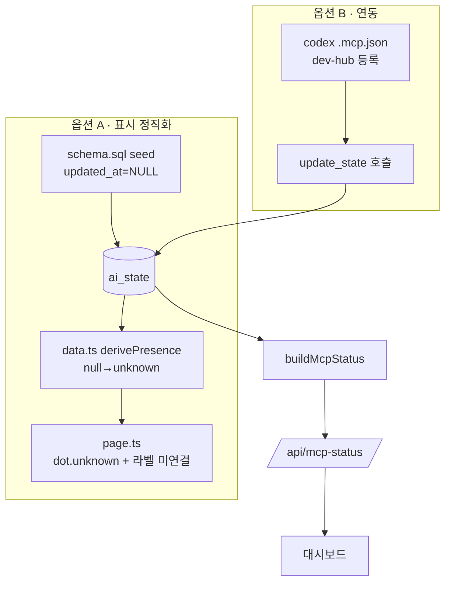

# Plan — 대시보드 codex 비활성(offline) 문제

> 작성: 2026-06-13 · 트리거: `/mstack-plan "대시보드에 codex는 활성화가 안된다"`
> 파이프라인: **[plan]** → review → implement → qa → ship

## 진단 (라이브 증거)

`GET https://mcp-dev-hub.mscho715.workers.dev/api/mcp-status` (2026-06-13 조회):

| agent    | status | presence | age_sec | updated_at                      |
| -------- | ------ | -------- | ------- | ------------------------------- |
| codex    | idle   | offline  | 14703   | 2026-06-13 06:45:30 (seed 시각) |
| claude   | idle   | offline  | 14703   | 2026-06-13 06:45:30 (seed 시각) |
| minimax  | idle   | offline  | 14703   | 2026-06-13 06:45:30 (seed 시각) |
| opencode | done   | offline  | 896     | 2026-06-13 10:35:37 (실제 갱신) |

- codex는 **대시보드에 존재함** — 누락 아님. presence=`offline`(빨강)으로 표시될 뿐.
- codex·claude·minimax는 `update_state`를 **한 번도 호출한 적 없음** (seed 타임스탬프 고정).
- presence 규칙(`src/dashboard/data.ts`): age ≤120s `online` / ≤600s `stale` / 그 외 `offline`. seed 행은 `updated_at = datetime('now')`(`schema.sql:16`)라서 10분 뒤 무조건 빨강 `offline`.

### 근본 원인 (2개)

1. **표시 결함**: "미연결(한 번도 보고 안 함)"과 "끊김(보고하다 멈춤)"을 구분 못 함 → codex가 고장난 것처럼 보임. **레포 내 수정 가능.**
2. **연동 미비**: codex가 작업 시 `update_state` MCP 툴을 호출하지 않음. 대시보드는 codex를 대신 켤 수 없음. **codex 쪽 설정 필요.**

---

## Phase 1 — CEO Review

### 1.1 문제 정의

현재: codex가 대시보드에서 항상 빨강 `offline`으로 표시되어 "활성화 안 됨"으로 보임.
목표: (a) 미연결 에이전트를 빨강이 아닌 중립색 "대기/미연결"로 정직하게 표시, (b) codex가 실제 heartbeat를 보내면 즉시 초록 `online`으로 전환.
영향: 4개 AI 협업 대시보드의 신뢰도 — 운영자가 "codex 죽었나?"를 매번 오해.

### 1.2 제안 옵션

| 옵션                         | 설명                                                                                                                          | 공수  | 리스크                   | 비고                                       |
| ---------------------------- | ----------------------------------------------------------------------------------------------------------------------------- | ----- | ------------------------ | ------------------------------------------ |
| **A. 표시 정직화 (레포 내)** | seed 행 `updated_at=NULL` → presence `unknown`("대기/미연결" 회색). 첫 실제 보고 시 자동 초록. dot/라벨에 unknown 스타일 추가 | 0.5일 | 낮음                     | codex를 켜진 않지만 "고장처럼 보임"을 제거 |
| **B. codex 연동 (codex 측)** | codex CLI에 dev-hub MCP 등록 + 작업 시 `update_state` 호출(또는 경량 heartbeat). 문서/설정 제공                               | 0.5일 | 중간(codex 측 실행 의존) | 실제 codex를 초록으로 만드는 유일한 방법   |
| **C. A + B 동시**            | 표시 정직화 + 연동 가이드/설정 함께 제공                                                                                      | 1일   | 낮음                     | 권장                                       |

### 1.3 추천 & 근거

- **C 권장.** A만 하면 codex는 여전히 "대기"(회색)일 뿐 실제 활성화 안 됨. B만 하면 다른 미연결 AI가 여전히 빨강으로 오해를 유발.
- A는 이 레포에서 안전하게 끝나고, B는 codex가 `update_state`를 호출하도록 wiring하는 별도 작업.
- 롤백: A는 schema seed 1줄 + data/page 표시 코드 → git revert 1커밋. B는 설정 파일이라 무위험.

### 1.4 승인 요청

`[ ] Phase 1 승인` — A / B / C 중 선택해 주세요. (기본 권장: **C**)

---

## Phase 2 — Engineering Review

### 2.1 아키텍처

### 2.2 파일 변경 목록 (옵션 C 기준)

| 파일                         | 유형    | 설명                                                                              |
| ---------------------------- | ------- | --------------------------------------------------------------------------------- |
| `src/db/schema.sql`          | modify  | seed 4줄: `updated_at` 명시적 `NULL`로 삽입 (미연결=unknown)                      |
| `src/dashboard/data.ts`      | modify  | (변경 거의 없음 — `derivePresence(null)`이 이미 `unknown` 반환) 주석/테스트만     |
| `src/dashboard/data.test.ts` | modify  | `updated_at=null` → presence `unknown` 케이스 추가                                |
| `src/dashboard/page.ts`      | modify  | `.dot.unknown`/`.dot.stale` CSS 추가, `unknown` 라벨을 "대기"로 표기, 빈 dot 처리 |
| `src/dashboard/page.ts`      | modify  | (선택) 범례 또는 tooltip: online/stale/offline/대기 의미 표기                     |
| `docs/` 또는 `CLAUDE.md`     | modify  | (옵션 B) codex가 `update_state` 호출하도록 MCP 등록 스니펫 + heartbeat 사용법     |
| `.mcp.json` 예시             | create? | (옵션 B) codex CLI용 dev-hub MCP 등록 예시 — 기존 파일 충돌 확인 필요             |

> ⚠️ **공유/배포 주의**: `schema.sql` 변경은 **이미 seed된 프로덕션 D1에는 `INSERT OR IGNORE`라서 재적용 안 됨**. 기존 codex/claude/minimax 행의 `updated_at`을 NULL로 되돌리려면 일회성 `UPDATE ai_state SET updated_at=NULL WHERE agent IN(...) AND status='idle'` 마이그레이션 필요. → implement 단계에서 명시.

> ⚠️ **브랜치 주의**: 현재 체크아웃은 `feat/guard-doc-pipeline-20260613`(OpenCode WIP 18파일). page.ts/index.ts는 OpenCode가 수정 중 → **격리된 master worktree에서만 작업**, OpenCode WIP 직접 수정 금지.

### 2.3 의존성 & 순서

1. schema seed 수정 (NULL heartbeat)
2. data.ts/test 보강 (unknown 케이스 회귀 테스트)
3. page.ts dot/라벨 (unknown 중립 표시)
4. (B) codex 연동 문서/설정
5. 프로덕션 D1 일회성 UPDATE 마이그레이션 (idle 미연결 행 → updated_at NULL)

### 2.4 테스트 전략

- 단위: `derivePresence(null)===‘unknown’` (기존 동작 회귀 잠금), seed NULL→unknown 매핑.
- 통합: 로컬 `npm run dev` → `/api/mcp-status`에서 codex presence=`unknown` 확인.
- 회귀 위험: `data.test.ts`가 `updated_at: nowIso`/`'2020-...'`로 online/offline 단정 — NULL 케이스 추가만, 기존 단정 유지.

### 2.5 리스크 & 완화

- **성능**: 없음 (표시 로직).
- **호환성**: schema `INSERT OR IGNORE`는 신규 DB에만 적용 → 기존 prod는 별도 UPDATE 필요(위 명시).
- **보안**: 없음 (공개 read-only 데이터, 쓰기 키 게이트 유지).
- **codex 의존(B)**: codex가 끝내 `update_state`를 안 부르면 여전히 "대기"(회색) — 이는 정직한 표시이므로 수용 가능.

---

## 승인 후 다음 단계

> 옵션 선택 후 `/mstack-implement` 또는 바로 구현 착수. (master worktree 격리 패턴)
