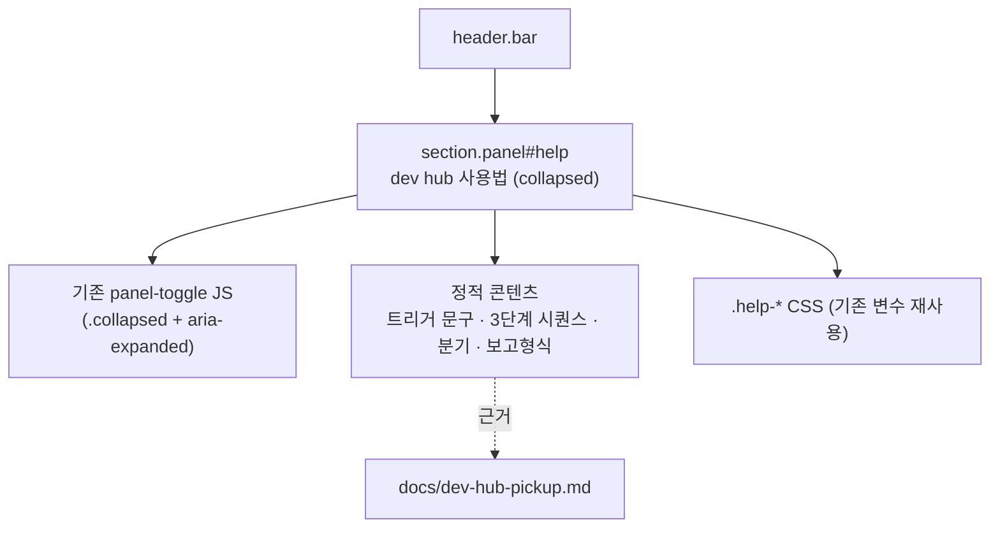

# Plan — 대시보드에 "dev hub 사용법" 표시

> 작성: 2026-06-13 · 트리거: `/mstack-plan "대시보드에 dev hub 사용법을 표시하라"`
> 파이프라인: **[plan]** → review → implement → qa → ship

## Phase 1 — CEO Review

### 1.1 문제 정의

현재: "dev hub" 트리거를 만들었지만 **대시보드 어디에도 사용법이 없어** 운영자·다른 AI가 명령어 존재/사용법을 모른다.
목표: 대시보드에서 **"dev hub"라고 치면 뭐가 되는지** 바로 보이게 한다.
영향: 4-AI 협업 대시보드의 발견성/온보딩 — 명령어를 매번 기억하거나 문서를 뒤질 필요 제거.

### 1.2 제안 옵션

| 옵션                                            | 설명                                                                           | 공수  | 리스크          | 발견성            |
| ----------------------------------------------- | ------------------------------------------------------------------------------ | ----- | --------------- | ----------------- |
| **A. 접이식 "dev hub 사용법" 패널 (기본 접힘)** | 기존 collapsible 패턴 재사용. 헤더 아래 풀폭 패널, 제목으로 발견·접으면 공간 0 | 0.3일 | 낮음            | 높음(제목 보임)   |
| **B. 헤더 "?" 토글 팝오버**                     | 상태칩 옆 작은 ? 버튼 → 클릭 시 사용법 팝오버                                  | 0.4일 | 낮음            | 중간(아이콘 놓침) |
| **C. 항상 보이는 상단 힌트 배너**               | 헤더 아래 1줄 고정 안내                                                        | 0.2일 | 낮음(공간 차지) | 최고              |

### 1.3 추천 & 근거

- **A 권장.** 기존 `panel-toggle`/`panel-body` 패턴·토글 JS를 그대로 재사용해 코드/리스크 최소. 제목("dev hub 사용법")으로 발견성 확보, 기본 접힘이라 평소 공간 0.
- B는 새 팝오버 JS·바깥클릭 닫기 등 추가 로직 필요. C는 항상 공간 차지.
- 롤백: page.ts 1파일 추가 블록 → git revert 1커밋.

### 1.4 승인 요청

`[ ] Phase 1 승인` — A / B / C 중 선택 (기본 권장: **A**)

---

## Phase 2 — Engineering Review

### 2.1 아키텍처

데이터 흐름 없음 — 순수 정적 HTML/CSS. `renderDashboard()`의 동적 갱신 경로와 무관.

### 2.2 파일 변경 목록

| 파일                    | 변경 유형     | 설명                                                                                                                                                                                                                    |
| ----------------------- | ------------- | ----------------------------------------------------------------------------------------------------------------------------------------------------------------------------------------------------------------------- |
| `src/dashboard/page.ts` | modify        | (1) 헤더 아래 접이식 `section.panel#help` HTML 블록, (2) `.help-step`/`.help-kbd` 등 CSS(기존 `--mono`/`--muted`/`--border`/`--accent` 재사용), (3) 토글 JS는 기존 panel-toggle 셀렉터가 자동 포함 — **추가 JS 불필요** |
| `src/index.test.ts`     | modify (선택) | `/dashboard` 응답에 "dev hub" 사용법 마커 포함 smoke 1개                                                                                                                                                                |

> 파일 신규 생성 없음 — 충돌 위험 없음.

### 2.3 의존성 & 순서

1. CSS 블록 추가(`.stage`/`.folder-chip` 인근)
2. 헤더(`</header>`) 직후 접이식 패널 HTML 삽입
3. (선택) index.test.ts smoke

- 기존 토글 JS가 `.panel-toggle` 전체를 대상으로 동작하므로 새 패널도 자동 접힘/펼침. 의존 순서 단순.

### 2.4 콘텐츠(표시할 사용법)

- **트리거**: `dev hub` · `devhub` · `dev-hub` · `데브허브` · `/dev-hub`
- **동작 3단계**: `get_handoff` → `get_dashboard` → `list_tasks`
- **분기**: 핸드오프 있음 → 이어받기 / 할당만 있음 → 계속 / 없음 → "이어받을 작업 없음"
- **한 줄**: "채팅에 dev hub 입력 → 내게 온 인계·태스크 자동 체크 후 이어받기"
- 하단에 근거 링크 표기: `docs/dev-hub-pickup.md`

### 2.5 테스트 전략

- 단위: 없음(정적 콘텐츠). 기존 76개 테스트 유지 확인.
- 통합: 로컬 `npm run dev` → `/dashboard` 200 + "dev hub 사용법" 문자열 + 토글 동작 스모크.
- 회귀 위험: 기존 패널 그리드 레이아웃 — 풀폭 패널은 `.grid` 밖(헤더 아래)에 두어 그리드 영향 없음.

### 2.6 리스크 & 완화

- **레이아웃**: 풀폭·기본 접힘으로 기존 패널 그리드와 분리 → 영향 최소.
- **호환성**: 기존 panel-toggle JS 재사용 → 신규 JS 0, 회귀 가능성 최소.
- **보안**: 정적 텍스트, 쓰기 경로 없음 → 무위험. (공개 read-only 대시보드 정책 유지)
- **컨벤션**: 외부 템플릿 리터럴 안 — 백틱/백슬래시 금지 규칙 준수(정적 텍스트라 해당 없음).

---

## 승인 후 다음 단계

옵션 선택(기본 A) → 바로 구현 → type-check·test·lint → 로컬 스모크 → 커밋 → (요청 시) 배포.
