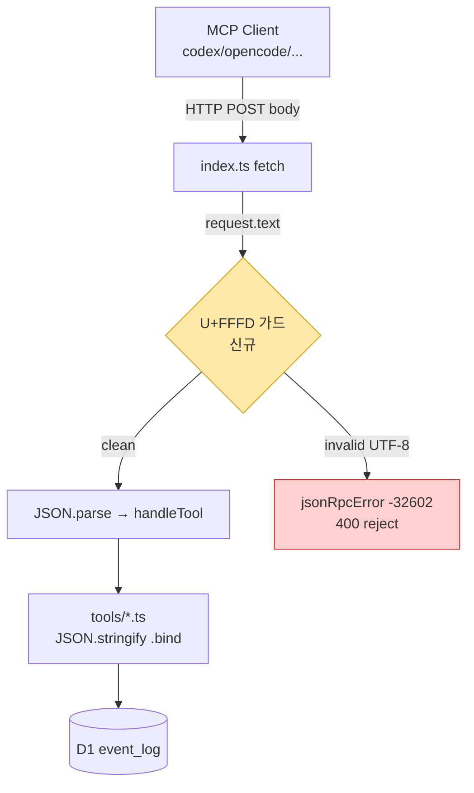

# Plan — UTF-8 인코딩 경계 가드 (event payload 깨짐 방지)

> 작성일: 2026-06-13 · 파이프라인: **[plan]** → review → ship → qa → retro
> 배경: codex 클라이언트가 CP949로 전송한 body가 워커에서 UTF-8 디코딩되어 U+FFFD로 손상(SESS-001). 워커 직렬화는 정상이나, 잘못된 인코딩이 쓰기 시점에 **조용히 저장**되는 것이 문제.

---

## Phase 1 — CEO Review (비즈니스 한 장)

### 1.1 문제 정의

- **현재**: 비(非)UTF-8 요청 body가 들어오면 U+FFFD(복구 불가 치환문자)로 손상된 채 D1에 영구 저장됨. 데이터 손실을 사후에야 발견.
- **목표**: 손상된 payload를 **쓰기 시점(요청 진입)에서 거부**(fail-fast)하여 D1 오염 방지.
- **영향 범위**: 모든 11개 MCP 도구의 payload/인자. 멀티-AI 협업 로그 신뢰성 직결. SLA·매출 영향 없음(내부 도구), 데이터 정합성 리스크 제거.

### 1.2 제안 옵션

| 옵션         | 설명                                                                                           | 공수  | 리스크                                  | 비용(AED) |
| ------------ | ---------------------------------------------------------------------------------------------- | ----- | --------------------------------------- | --------- |
| **A (추천)** | `index.ts` 단일 진입점에 U+FFFD 경계 가드 1개 추가 → 전 도구 커버                              | 0.5일 | 낮음                                    | 0         |
| B            | 각 도구(event/session/election/retro/discussion)의 `JSON.stringify` 직전에 가드 삽입 (8+ 지점) | 1.5일 | 중간(누락 가능, 코드 중복)              | 0         |
| C            | 변경 없음 — 클라이언트(codex)만 `PYTHONUTF8=1`로 수정                                          | 0.1일 | 높음(다른 클라이언트 재발, 강제력 없음) | 0         |

### 1.3 추천 & 근거

- **옵션 A 추천**. `index.ts:60-65`가 모든 `tools/call`의 단일 디코딩 지점 → 한 곳에서 전체 커버. `golden-principles #6 (시스템 경계 검증)`·`#12 (surgical)`에 부합.
- 코드 중복 0, 누락 위험 0, 신규 도구도 자동 보호.
- **롤백**: 단일 커밋 revert (변경 파일 1~2개, 위험 극소).

### 1.4 승인 요청

`[ ] Phase 1 승인`

---

## Phase 2 — Engineering Review (기술 상세)

### 2.1 아키텍처 다이어그램

핵심: 가드는 `request.json()` → `request.text()` + 검사 + `JSON.parse()`로 교체. 도구 코드(`T`)는 **무변경**.

### 2.2 파일 변경 목록

| 파일                | 변경 유형     | 설명                                                                                                        |
| ------------------- | ------------- | ----------------------------------------------------------------------------------------------------------- |
| `src/index.ts`      | modify        | `request.json()`(L62)을 text-read → U+FFFD 검사 → `JSON.parse`로 교체. 검출 시 `-32602` + 400               |
| `src/index.test.ts` | modify        | 기존 파일에 케이스 **추가**(신규 파일 아님): U+FFFD 포함 body → -32602/400 단언, 정상 한글 body → 통과 단언 |
| `src/lib/mcp.ts`    | modify (선택) | 응답 `Content-Type`에 `; charset=utf-8` 명시 (방어적, 표시용)                                               |

> **파일명 충돌 체크**: 신규 `create` 파일 없음. `index.test.ts`는 기존 파일에 케이스 추가만 → 충돌 없음.

### 2.3 의존성 & 순서

1. `index.ts` 가드 구현 (RED 테스트 먼저)
2. `index.test.ts` 케이스 추가 → GREEN 확인
3. (선택) `mcp.ts` charset — 독립, 1·2 이후 아무 때나

- 단일 작업, Agent Teams 불필요 (SINGLE 모드).

### 2.4 테스트 전략

- **단위(Vitest)**:
  - `U+FFFD 포함 body` → 응답 `{error.code: -32602}`, status 400
  - `정상 한글 payload (예: "통합 테스트 완료")` → 정상 처리, D1 저장 후 동일 문자열 반환 (회귀 방지)
  - `깨진 JSON` → 기존 -32700 동작 유지 (가드가 parse error 동작 안 깨뜨림)
- **Red-Green-Refactor**: 가드 제거 시 U+FFFD 케이스 FAIL 확인 → 가드 복원 시 PASS.
- **기존 테스트 깨질 가능성**: `index.test.ts`의 기존 `tools/call`·`tools/list` 케이스 — `request.text()+JSON.parse`가 `request.json()`과 동치이므로 영향 없음. 전체 31개 도구 테스트 재실행으로 검증.

### 2.5 리스크 & 완화

| 리스크                                                                               | 완화                                                   |
| ------------------------------------------------------------------------------------ | ------------------------------------------------------ |
| `request.text()`로 교체 시 대용량 body 메모리                                        | payload 소형(수 KB) → 무시 가능                        |
| 정상 데이터에 U+FFFD가 의도적으로 포함된 극단 케이스                                 | 실무상 없음. 거부가 안전 측 기본값                     |
| ⚠️ **공유/코어 모듈 변경** (`src/index.ts`, `src/lib/mcp.ts`) — `/careful` 경고 대상 | 변경 최소화, 리드 검토 권장. 동작 동치성 테스트로 보증 |

---

## 파이프라인 연결

계획 확정 시: `/review` 체크리스트 준비 또는 바로 구현(`/mstack-implement`, TDD RED부터).
